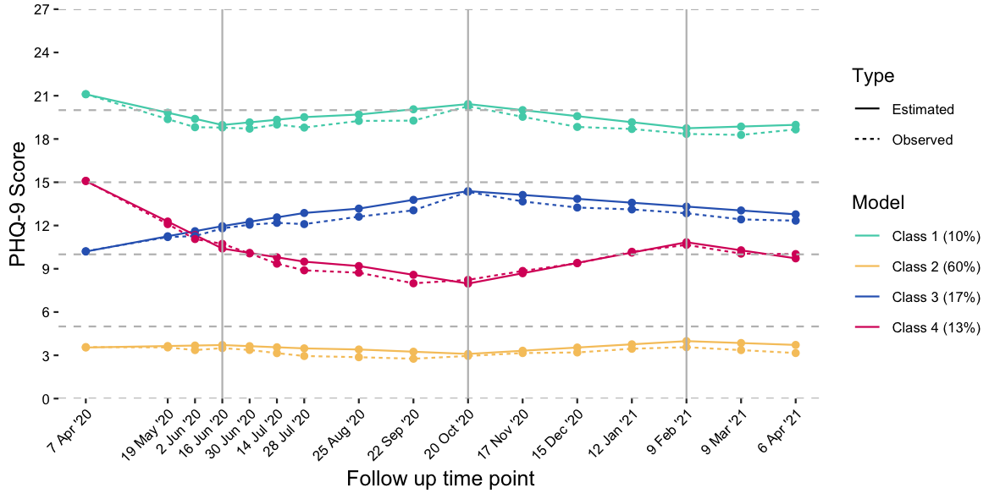
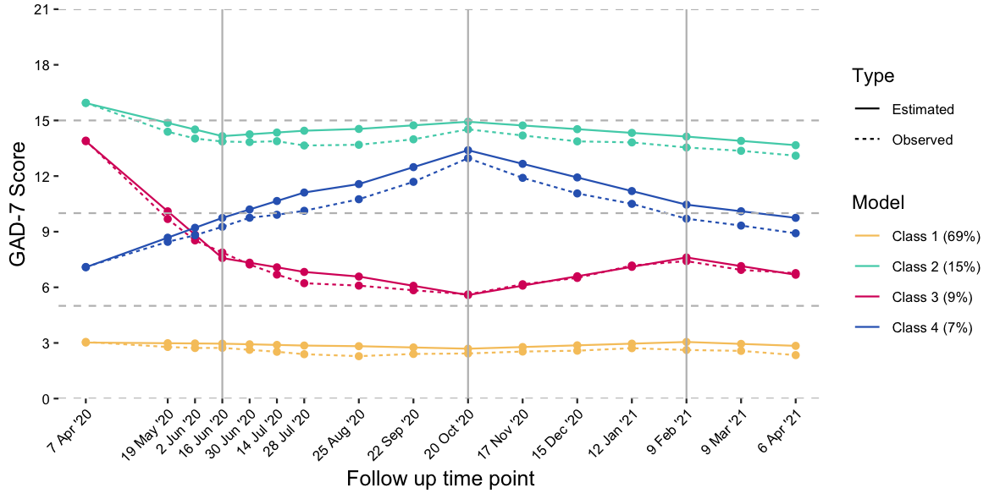
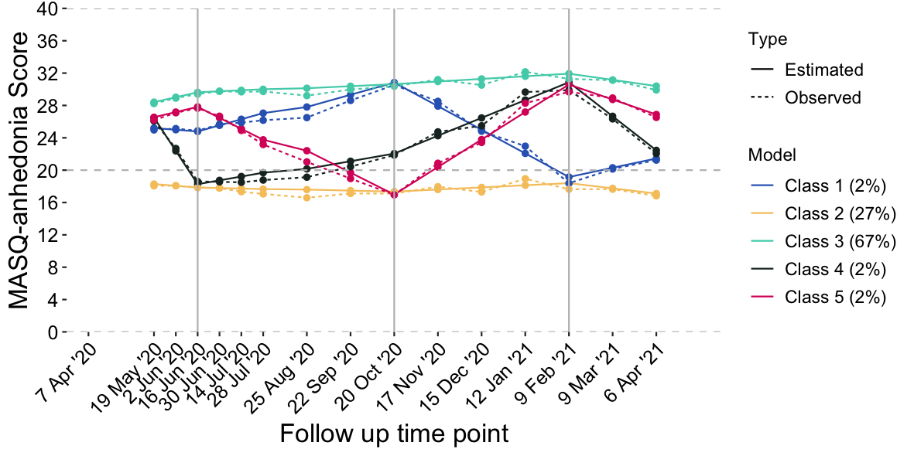

# Background
## Overview
We perform multinomial logistic regressions using the *multinom* function from the **nnet** package to predict latent class membership (most likely trajectory assignment) in our best GMM model for each symptom measure (anxiety, GAD-7; depression, PHQ-9; anhedonia, MASQ AD anhedonia subscale). 

## Description of best model for each symptom measure

See GMM notebooks and [pre-registration](https://osf.io/jvca5/) for a description of how best models were selected. An overview of the model for each symptom measure and a brief explanation for its selection is described here.

### Depression (PHQ-9)

A 4 class model was selected, based on the following rationale (criteria set in the pre-registration)

1. Increasing the number of classes led to reductions in BIC and AIC. 
2. Models identifying classes with <1% of the total sample should be discarded: this did not occur in any models.
3. Visual inspection of scree plots of BIC values: inflection point observed at 4-class model (i.e., the slope of change in BIC from class 3 to class 4 was steeper than the slope of change from class 4 to class 5). From this, the models at, or immediately after, the inflection point could be selected (4-class or 5-class).
4. The 4-class model had a higher entropy, so this model was selected. 



We interpret each class as follows:

**Class 1 (green line): high stable (10%; n=4341)**

**Class 2 (yellow line): low stable (60%; n=25364)**

**Class 3 (blue line): increasing, then decreasing (17%, n=6977)**

**Class 4 (red line): variable (13%, n=5324)**


### Anxiety (GAD-7)

A 4 class model was selected, based on the following rationale (criteria set in the pre-registration)

1. Increasing the number of classes led to reductions in BIC and AIC. 
2. Models identifying classes with <1% of the total sample should be discarded: this did not occur in any models.
3. Visual inspection of scree plots of BIC values: inflection point observed at 4-class model (i.e., the slope of change in BIC from class 3 to class 4 was steeper than the slope of change from class 4 to class 5). From this, the models at, or immediately after, the inflection point could be selected (4-class or 5-class).
4. The 4-class model had a higher entropy, so this model was selected. 



We interpret each class as follows:

**Class 1 (green line): low stable (69%; n=28640)**

**Class 2 (yellow line): high stable (15%; n=6064)**

**Class 3 (green line): variable (9%; n=3854)**

**Class 4 (red line): increasing, then decreasing (7%; n=2887)**

### Anhedonia (MASQ)

A 5 class model was selected, based on the following rationale (criteria set in the pre-registration)

1. Increasing the number of classes led to reductions in BIC and AIC. 
2. Models identifying classes with <1% of the total sample should be discarded: this occurred for 6- and 7-class models.
3. Visual inspection of scree plots of BIC values: inflection point observed at 4-class model (i.e., the slope of change in BIC from class 3 to class 4 was steeper than the slope of change from class 4 to class 5). From this, the models at, or immediately after, the inflection point could be selected (4-class or 5-class).
4. The 5-class model had a higher entropy, so this model was selected.

**update after reviewer comments indicating 4-class is more common in the literature (& likelihood of substantial overlap with phq/gad models - the more parsimonious 4 class model was selected)



We interpret each class as follows:

**Class 1 (green line): variable3 (2%; n=562)**

**Class 2 (yellow line): low stable (27%; n=8791)**

**Class 3 (blue line): high stable (67%; n=22099)**

**Class 4 (red line): variable1 (2%; n=781)**

**Class 5 (black line): variable2 (2%; n=659)**


## Description of selected predictors

The predictors we include which were significant predictors of change in symptoms of anxiety and/or depression in our sample from before the pandemic to the first measurement point during the pandemic are:

* Gender (being female predicted worsening of symtoms)    
* Age (being younger; i.e. <35, predicted worsening of symptoms)    
* Employment status pre pandemic (being unemployed predicted worsening of symptoms)  
* Pre-existing mental health diagnoses (a range of mental health diagnoses predicted worsening of symptoms)   

We include a few additional measures which were not significant predictors in our first paper, but which we feel are important to consider here.

* ethnicity (described in the pre-registration; see note below for more detail) 
* key worker status. 
This was a predictor in our first paper, although we did not plan to include it in the pre-registration, given the piecewise nature of our best fitting latent growth curve based on national pandemic related events, we consider this to be a potentially important explanatory variable for differing responses to lockdowns and restrictions easing.
* employment change during early pandemic (increased employment or became employed, decreased employment or became unemployed, furloughed, no change). 
Whilst we did not use this variable in our earlier paper, given the role for employment n change from pre-pandemic to early pandemic, it is reasonable to infer that any change in employment status during the pandemic may be an important predictor of symptom trajectories during the pandemic. 

### A note on how we will handle ethnicity as a predictor.

We will use the ethnicity variable in two different ways in order to ensure we are making the best possible use of the data we have available for this important predictor. First, we will use each self reported ethnicity category as an individual predictor. Although each individual group may be too small to be well powered to detect small effects, we feel it is important to recognise that experiences of different minoritised ethnic communities are not homogeneous, and these different experiences may have an important impact on the overall trajectory of mental healthy symptoms during the pandemic.By collapsing across different minoritsed ethnic community groups, we may miss important differences in potential risk factors and outcomes associated with any one specific ethnicity or background experience. 

We will then perform a second analysis, where we group all minoritised ethnic communities together, comparing them to the visible majority white ethnicity group. Whist this grouping does not respect the different experiences that different communities may experience, it does consider the impact of being a "visible minority" and the potential risk for discrimination that this may bring. This analysis will be better powered to detect smaller effects.

We hope that by performing this analysis in both ways, we will be able to fully consider the possible impact of experiences of all ethnic communities on anxiety, depression and anhedonia trajectories throughout the pandemic. 

# Analyses

## set up

```{r, include=FALSE}
# clear global environment
remove(list = ls())
```

```{r setup, include=FALSE}
knitr::opts_chunk$set(echo = TRUE,
                      comment=NA,
                      prompt=FALSE,
                      cache=FALSE)

if(!require(gtsummary)){
  install.packages("gtsummary")
  library(gtsummary)
}

if(!require(nnet)){
  install.packages("nnet")
  library(nnet)
}

if(!require(scales)){
  install.packages("scales")
  library(scales)
}

if(!require(kableExtra)){
  install.packages("kableExtra")
  library(kableExtra)
}

if(!require(dplyr)){
  install.packages("dplyr")
  library(dplyr)
}


if(!require(forcats)){
  install.packages("forcats")
  library(forcats)
}


if(!require(tidyverse)){
  install.packages("tidyverse")
  library(tidyverse)
}

if(!require(writexl)){
  install.packages("writexl")
  library(writexl)
}

options(scipen = 999)

```

read in all functions from function library

```{r call in function library functions, include=FALSE}
# source all functions in the function library folder
files.sources = paste0("../functions/",list.files("../functions"))
sapply(files.sources, source)

```

```{r colour palette, include=FALSE}

forest.palette <- c("#C98686","#4ED1B7", "#F6C66A", "#3066BE", "#D90368","#3C5A14",  "#AF3800","#680E4B") 

```
### read in class probability and predictor data

The format of the data output saved from Cprobabilities in mplus is: 

first section  = that persons raw data for each time point (as many columns as there are time points, so GAD and PHQ = 17, MASQ = 15)  
Second section = Individuals Intercept, Lin1 slope, lin2 slope lin 3 slope, lin4 slope (always 5 columns)
Third section = Class intercept, ine1 slope, lin2 slope, lin3 slope, lin4 slope (always 5 columns)
Fourth section = class posterior probability estimate for each estimated class (as many columns as there are classes)   
Second last column: most likely class membership
Last column: ID

```{r read in class probability data, include=FALSE}

phq_mplus <-read.table("../GrowthMixtureModelling/MPlus_input_gmm/PHQ/gmm_phq_piece_4class_probs.dat", 
                           header=FALSE)

gad_mplus <- read.table("../GrowthMixtureModelling/MPlus_input_gmm/GAD/gmm_gad_piece_4class_probs.dat", 
                           header=FALSE)

masq_mplus <- read.table("../GrowthMixtureModelling/MPlus_input_gmm/MASQ/gmm_masq_piece_4class_probs.dat", 
                           header=FALSE)

```

read in the predictor data

```{r read in predictor data, include=FALSE}

phq_predictors <-readRDS("../../../data_clean/phq/phq.mplus_matched_predictors.rds")

gad_predictors <- readRDS("../../../data_clean/gad/gad.mplus_matched_predictors.rds")

masq_predictors <- readRDS("../../../data_clean/masq/masq.mplus_matched_predictors.rds")

```


##Data preparation
### name and select the class and ID variables for multinomial regression
use our custom function *rename_class_data*
```{r name and select the right variables, include=FALSE}

#PHQ

 names(phq_mplus) <- rename_class_data(phq_mplus)
 phq_class_data <- phq_mplus %>%
   select(hash_id,MostLikelyClass)

#GAD

 names(gad_mplus) <- rename_class_data(gad_mplus)
 gad_class_data <- gad_mplus %>%
   select(hash_id,MostLikelyClass)

#MASQ
names(masq_mplus) <- rename_class_data(masq_mplus)
masq_class_data <- masq_mplus %>%
  select(hash_id,MostLikelyClass)

```

### merge predictors with mplus class data

Left join using MPlus hashed ID so we only retain those included in the MPlus model stage.

This doesn't change the numbers (reassuring)

```{r merge data with predcictors, include=FALSE}

phq_predictors <- phq_predictors[!apply(is.na(phq_predictors[,3:16]), 1, all),]
gad_predictors <- gad_predictors[!apply(is.na(gad_predictors[,3:16]), 1, all),]
masq_predictors <- masq_predictors[!apply(is.na(masq_predictors[,3:16]), 1, all),]

nrow(phq_predictors)
nrow(gad_predictors)
nrow(masq_predictors)


# PHQ 
 phq.AllData <- left_join(phq_predictors,
                          phq_class_data)

# GAD
 gad.AllData <- left_join(gad_class_data,
                           gad_predictors)

 # MASQ
 masq.AllData <- left_join(masq_class_data,
                          masq_predictors)
```

### drop people without data on any predictor

this represents people who were not missing on all variables as per MPLus output file, and our true analytic sample.

```{r drop no predictor or trajectory data}

phq.AllData <- phq.AllData[!apply(is.na(phq.AllData[,20]), 1, all),]
#REDUCING FROM 46089 to 41753 datapoints 
gad.AllData <- gad.AllData[!apply(is.na(gad.AllData[,4:17]), 1, all),]
#REDUCING FROM 46087 to 41192 datapoints 
masq.AllData <- masq.AllData[!apply(is.na(masq.AllData[,4:17]), 1, all),]
#REDUCING FROM 36964 to 32689 datapoints 
```

#combined summary table demographcis
```{r combined summary table for paper}

if(!require(expss)){
  library(expss)
  install.packages("expss",repos = "http://cran.us.r-project.org")
}

combined_table <- phq.AllData  %>% tab_cells("Age" = age, "Gender" = gender,"Ethnicity" = ethnicity, "Ethnicity - clustered" = ethnicity_clustered, "Change in employment" = employment_change, "Pre-pandemic employment" = employment_prior_covid, "Keyworker status" = key_worker, "Depressive disorder diagnosis" = depressive_disorders, "Anxiety disorder diagnosis" = anxiety_disorders, "OCD diagnosis" = obsessive_compulsive_disorders, "Psychotic disorder diagnosis" = psychotic_disorders, "Bipolar disorder diagnosis" = bipolar_disorders,"Eating disorder diagnosis" = eating_disorders, "Personality disorder diagnosis" = personality_disorders, "PTSD diagnosis" = ptsd_disorders, "ASD diagnosis" = autism_disorders) %>% 
    tab_cols(total(label = "N")) %>% 
    tab_stat_cases(total_row_position = "none") %>% 
    tab_pivot() %>% 
    kable()

combined_table

coping_table <- phq.AllData  %>% 
  filter(sample == "COPING") %>% tab_cells("Age" = age, "Gender" = gender,"Ethnicity" = ethnicity, "Ethnicity - clustered" = ethnicity_clustered, "Change in employment" = employment_change, "Pre-pandemic employment" = employment_prior_covid, "Keyworker status" = key_worker, "Depressive disorder diagnosis" = depressive_disorders, "Anxiety disorder diagnosis" = anxiety_disorders, "OCD diagnosis" = obsessive_compulsive_disorders, "Psychotic disorder diagnosis" = psychotic_disorders, "Bipolar disorder diagnosis" = bipolar_disorders,"Eating disorder diagnosis" = eating_disorders, "Personality disorder diagnosis" = personality_disorders, "PTSD diagnosis" = ptsd_disorders, "ASD diagnosis" = autism_disorders) %>% 
    tab_cols(total(label = "N")) %>% 
    tab_stat_cases(total_row_position = "none") %>% 
    tab_pivot() %>% 
    kable()

coping_table

ramp_table <- phq.AllData  %>% 
  filter(sample == "RAMP") %>% tab_cells("Age" = age, "Gender" = gender,"Ethnicity" = ethnicity, "Ethnicity - clustered" = ethnicity_clustered, "Change in employment" = employment_change, "Pre-pandemic employment" = employment_prior_covid, "Keyworker status" = key_worker, "Depressive disorder diagnosis" = depressive_disorders, "Anxiety disorder diagnosis" = anxiety_disorders, "OCD diagnosis" = obsessive_compulsive_disorders, "Psychotic disorder diagnosis" = psychotic_disorders, "Bipolar disorder diagnosis" = bipolar_disorders,"Eating disorder diagnosis" = eating_disorders, "Personality disorder diagnosis" = personality_disorders, "PTSD diagnosis" = ptsd_disorders, "ASD diagnosis" = autism_disorders) %>% 
    tab_cols(total(label = "N")) %>% 
    tab_stat_cases(total_row_position = "none") %>% 
    tab_pivot() %>% 
    kable()

ramp_table
```

## Descriptives of the relationship between class and predictors {.tabset}

### PHQ

```{r cross tabs age phq}

tbl_cross(phq.AllData, 
          row=MostLikelyClass, col=age,
          percent = "row")

```


```{r cross tabs gender phq}

tbl_cross(phq.AllData, 
          row=MostLikelyClass, col=gender,
          percent = "row")

```
```{r cross tabs ethnicity phq}

tbl_cross(phq.AllData, 
          row=MostLikelyClass, col=ethnicity,
          percent = "row")

```

```{r cross tabs ethnicity clustered phq}

tbl_cross(phq.AllData, 
          row=MostLikelyClass, col=ethnicity_clustered,
          percent = "row")

```

```{r cross tabs employment prior phq}

tbl_cross(phq.AllData, 
          row=MostLikelyClass, col=employment_prior_covid,
          percent = "row")

```

```{r cross tabs employment change phq}

tbl_cross(phq.AllData, 
          row=MostLikelyClass, col=employment_change,
          percent = "row")

```

```{r cross tabs key worker phq}

tbl_cross(phq.AllData, 
          row=MostLikelyClass, col=key_worker,
          percent = "row")

```

```{r cross tabs anxiety_disorder phq}

tbl_cross(phq.AllData, 
          row=MostLikelyClass, col=anxiety_disorders,
          percent = "row")

```

```{r cross tabs depressive_disorders phq}

tbl_cross(phq.AllData, 
          row=MostLikelyClass, col=depressive_disorders,
          percent = "row")

```


```{r cross tabs eating disorders phq}

tbl_cross(phq.AllData, 
          row=MostLikelyClass, col=eating_disorders,
          percent = "row")

```


```{r cross tabs obsessive compulsive disorders phq}

tbl_cross(phq.AllData, 
          row=MostLikelyClass, col=obsessive_compulsive_disorders,
          percent = "row")

```

```{r cross tabs psychotic disorders phq}

tbl_cross(phq.AllData, 
          row=MostLikelyClass, col=psychotic_disorders,
          percent = "row")

```

```{r cross tabs personality_disorders phq}

tbl_cross(phq.AllData, 
          row=MostLikelyClass, col=personality_disorders,
          percent = "row")

```


```{r cross tabs bipolar_disorders phq}

tbl_cross(phq.AllData, 
          row=MostLikelyClass, col=bipolar_disorders,
          percent = "row")

```

```{r cross tabs ptsd phq}

tbl_cross(phq.AllData, 
          row=MostLikelyClass, col=ptsd_disorders,
          percent = "row")

```

```{r cross tabs asd phq}

tbl_cross(phq.AllData, 
          row=MostLikelyClass, col=autism_disorders,
          percent = "row")

```

### GAD

```{r cross tabs age gad}

tbl_cross(gad.AllData, 
          row=MostLikelyClass, col=age,
          percent = "row")

```


```{r cross tabs gender gad}

tbl_cross(gad.AllData, 
          row=MostLikelyClass, col=gender,
          percent = "row")

```
```{r cross tabs ethnicity gad}

tbl_cross(gad.AllData, 
          row=MostLikelyClass, col=ethnicity,
          percent = "row")

```

```{r cross tabs ethnicity clustered gad}

tbl_cross(gad.AllData, 
          row=MostLikelyClass, col=ethnicity_clustered,
          percent = "row")

```

```{r cross tabs employment prior gad}

tbl_cross(gad.AllData, 
          row=MostLikelyClass, col=employment_prior_covid,
          percent = "row")

```

```{r cross tabs employment change gad}

tbl_cross(gad.AllData, 
          row=MostLikelyClass, col=employment_change,
          percent = "row")

```

```{r cross tabs key worker gad}

tbl_cross(gad.AllData, 
          row=MostLikelyClass, col=key_worker,
          percent = "row")

```

```{r cross tabs anxiety_disorder gad}

tbl_cross(gad.AllData, 
          row=MostLikelyClass, col=anxiety_disorders,
          percent = "row")

```

```{r cross tabs depressive_disorders gad}

tbl_cross(gad.AllData, 
          row=MostLikelyClass, col=depressive_disorders,
          percent = "row")

```


```{r cross tabs eating disorders gad}

tbl_cross(gad.AllData, 
          row=MostLikelyClass, col=eating_disorders,
          percent = "row")

```


```{r cross tabs obsessive compulsive disorders gad}

tbl_cross(gad.AllData, 
          row=MostLikelyClass, col=obsessive_compulsive_disorders,
          percent = "row")

```

```{r cross tabs psychotic disorders gad}

tbl_cross(gad.AllData, 
          row=MostLikelyClass, col=psychotic_disorders,
          percent = "row")

```

```{r cross tabs personality_disorders gad}

tbl_cross(gad.AllData, 
          row=MostLikelyClass, col=personality_disorders,
          percent = "row")

```


```{r cross tabs bipolar_disorders gad}

tbl_cross(gad.AllData, 
          row=MostLikelyClass, col=bipolar_disorders,
          percent = "row")

```

```{r cross tabs ptsd gad}

tbl_cross(gad.AllData, 
          row=MostLikelyClass, col=ptsd_disorders,
          percent = "row")

```

```{r cross tabs asd gad}

tbl_cross(gad.AllData, 
          row=MostLikelyClass, col=autism_disorders,
          percent = "row")

```


### MASQ

```{r cross tabs age masq}

tbl_cross(masq.AllData, 
          row=MostLikelyClass, col=age,
          percent = "row")

```


```{r cross tabs gender masq}

tbl_cross(masq.AllData, 
          row=MostLikelyClass, col=gender,
          percent = "row")

```
```{r cross tabs ethnicity masq}

tbl_cross(masq.AllData, 
          row=MostLikelyClass, col=ethnicity,
          percent = "row")

```

```{r cross tabs ethnicity clustered masq}

tbl_cross(masq.AllData, 
          row=MostLikelyClass, col=ethnicity_clustered,
          percent = "row")

```

```{r cross tabs employment prior masq}

tbl_cross(masq.AllData, 
          row=MostLikelyClass, col=employment_prior_covid,
          percent = "row")

```

```{r cross tabs employment change masq}

tbl_cross(masq.AllData, 
          row=MostLikelyClass, col=employment_change,
          percent = "row")

```

```{r cross tabs key worker masq}

tbl_cross(masq.AllData, 
          row=MostLikelyClass, col=key_worker,
          percent = "row")

```

```{r cross tabs anxiety_disorder masq}

tbl_cross(masq.AllData, 
          row=MostLikelyClass, col=anxiety_disorders,
          percent = "row")

```

```{r cross tabs depressive_disorders masq}

tbl_cross(masq.AllData, 
          row=MostLikelyClass, col=depressive_disorders,
          percent = "row")

```


```{r cross tabs eating disorders masq}

tbl_cross(masq.AllData, 
          row=MostLikelyClass, col=eating_disorders,
          percent = "row")

```


```{r cross tabs obsessive compulsive disorders masq}

tbl_cross(masq.AllData, 
          row=MostLikelyClass, col=obsessive_compulsive_disorders,
          percent = "row")

```

```{r cross tabs psychotic disorders masq}

tbl_cross(masq.AllData, 
          row=MostLikelyClass, col=psychotic_disorders,
          percent = "row")

```

```{r cross tabs personality_disorders masq}

tbl_cross(masq.AllData, 
          row=MostLikelyClass, col=personality_disorders,
          percent = "row")

```


```{r cross tabs bipolar_disorders masq}

tbl_cross(masq.AllData, 
          row=MostLikelyClass, col=bipolar_disorders,
          percent = "row")

```

```{r cross tabs ptsd masq}

tbl_cross(masq.AllData, 
          row=MostLikelyClass, col=ptsd_disorders,
          percent = "row")

```

```{r cross tabs asd masq}

tbl_cross(masq.AllData, 
          row=MostLikelyClass, col=autism_disorders,
          percent = "row")

```

## check multicolinearity

very large CI's on student/retired status. potential multicolinearity with age?

```{r multicolinearity checks, eval = FALSE}

xtabs(~ employment_prior_covid+age+MostLikelyClass, data = masq.AllData)
xtabs(~ employment_prior_covid+age+MostLikelyClass, data = phq.AllData)
xtabs(~ employment_prior_covid+age+MostLikelyClass, data = gad.AllData)

cor(str(masq.AllData$age), masq.AllData$employment_prior_covid, method = "spearman")

chisq.test(masq.AllData$age,masq.AllData$employment_prior_covid)
chisq.test(masq.AllData$age,masq.AllData$employment_change)
chisq.test(masq.AllData$age,masq.AllData$gender)

chisq.test(phq.AllData$age,phq.AllData$employment_prior_covid)
chisq.test(gad.AllData$age,gad.AllData$employment_prior_covid)

```
## recode employment variable
```{r recode employment variable, eval = FALSE}

phq.AllData <- phq.AllData %>%
  mutate(employment_prior_covid = case_when(
    employment_prior_covid == "Employed" ~ "Employed/Student/Retired",
    employment_prior_covid == "Student" ~ "Employed/Student/Retired",
    employment_prior_covid == "Retired" ~ "Employed/Student/Retired",
    employment_prior_covid == "Unemployed" ~ "Unemployed",
  ))

phq.AllData$employment_prior_covid <- as.factor(phq.AllData$employment_prior_covid)

gad.AllData <- gad.AllData %>%
  mutate(employment_prior_covid = case_when(
    employment_prior_covid == "Employed" ~ "Employed/Student/Retired",
    employment_prior_covid == "Student" ~ "Employed/Student/Retired",
    employment_prior_covid == "Retired" ~ "Employed/Student/Retired",
    employment_prior_covid == "Unemployed" ~ "Unemployed",
  ))

masq.AllData <- masq.AllData %>%
  mutate(employment_prior_covid = case_when(
    employment_prior_covid == "Employed" ~ "Employed/Student/Retired",
    employment_prior_covid == "Student" ~ "Employed/Student/Retired",
    employment_prior_covid == "Retired" ~ "Employed/Student/Retired",
    employment_prior_covid == "Unemployed" ~ "Unemployed",
  ))

          

```

## recode age variable
```{r recode age variable}

phq.AllData <- phq.AllData %>%
  mutate(age = case_when(
    age == "16-18" ~ "16-18",    
    age == "19-25" ~ "19-25",    
    age == "26-35" ~ "26-35",    
    age == "36-45" ~ "36-45",    
    age == "46-55" ~ "46-55",    
    age == "56-65" ~ "56-65",
    age == "66-70" ~ "66-70",
    age == "71-75" ~ "71+",
    age == "76+" ~ "71+"))

gad.AllData <- gad.AllData %>%
  mutate(age = case_when(
    age == "16-18" ~ "16-18",    
    age == "19-25" ~ "19-25",    
    age == "26-35" ~ "26-35",    
    age == "36-45" ~ "36-45",    
    age == "46-55" ~ "46-55",    
    age == "56-65" ~ "56-65",
    age == "66-70" ~ "66-70",
    age == "71-75" ~ "71+",
    age == "76+" ~ "71+"))

# masq.AllData <- masq.AllData %>%
#   mutate(age = case_when(
#     age == "16-18" ~ "16-18",    
#     age == "19-25" ~ "19-25",    
#     age == "26-35" ~ "26-35",    
#     age == "36-45" ~ "36-45",    
#     age == "46-55" ~ "46-55",    
#     age == "56-65" ~ "56-65",
#     age == "66-70" ~ "66-70",
#     age == "71-75" ~ "71+",
#     age == "76+" ~ "71+"))


          

```


## specify reference category for predictors

make age midpoint the reference for age, no change in employment the reference for employment change, all disorders have the no disorder group as reference, not a keyworker reference for key worker status

```{r relevel reference preedictors masq}

# PHQ
phq.AllData$age <- factor(phq.AllData$age,                                       levels=c("16-18","19-25","26-35","36-45","46-55","56-65","66-70","71+")) %>%
  relevel(phq.AllData$age, ref = "26-35")
#phq.AllData$age <- factor(phq.AllData$age,
#levels=c("16-18","19-25","26-35","36-45","46-55","56-65","66-70","71-75", "76+")) %>%
#  relevel(phq.AllData$age, ref = "26-35")

phq.AllData$employment_change <- factor(phq.AllData$employment_change,
                                       levels=c("Decreased employment","Employment not changed","Furloughed","Increased employment")) %>%
  relevel(phq.AllData$employment_change, ref = "Employment not changed")

phq.AllData$key_worker <- factor(phq.AllData$key_worker,
                                       levels=c("Government defined key worker","Not a key worker")) %>%
  relevel(phq.AllData$key_worker, ref = "Not a key worker")

phq.AllData$anxiety_disorders <- factor(phq.AllData$anxiety_disorders,
                                       levels=c("Anxiety disorder","No anxiety disorder")) %>%
  relevel(phq.AllData$anxiety_disorders, ref = "No anxiety disorder")

phq.AllData$depressive_disorders <- factor(phq.AllData$depressive_disorders,
                                       levels=c("Depressive disorder","No depressive disorder")) %>%
  relevel(phq.AllData$depressive_disorders, ref = "No depressive disorder")

phq.AllData$eating_disorders <- factor(phq.AllData$eating_disorders,
                                       levels=c("Eating disorder","No eating disorder")) %>%
  relevel(phq.AllData$eating_disorders, ref = "No eating disorder")

phq.AllData$obsessive_compulsive_disorders <- factor(phq.AllData$obsessive_compulsive_disorders,
                                       levels=c("Obsessive compulsive disorder","No obsessive compulsive disorder")) %>%
  relevel(phq.AllData$obsessive_compulsive_disorders, ref = "No obsessive compulsive disorder")

phq.AllData$psychotic_disorders <- factor(phq.AllData$psychotic_disorders,
                                       levels=c("Psychotic disorder","No psychotic disorder")) %>%
  relevel(phq.AllData$psychotic_disorders, ref = "No psychotic disorder")


phq.AllData$personality_disorders <- factor(phq.AllData$personality_disorders,
                                       levels=c("Personality disorder","No personality disorder")) %>%
  relevel(phq.AllData$personality_disorders, ref = "No personality disorder")


phq.AllData$bipolar_disorders <- factor(phq.AllData$bipolar_disorders,
                                       levels=c("Bipolar disorder","No bipolar disorder")) %>%
  relevel(phq.AllData$bipolar_disorders, ref = "No bipolar disorder")

phq.AllData$ptsd_disorders <- factor(phq.AllData$ptsd_disorders,
                                       levels=c("PTSD","No PTSD")) %>%
  relevel(phq.AllData$ptsd_disorders, ref = "No PTSD")

phq.AllData$autism_disorders <- factor(phq.AllData$autism_disorders,
                                       levels=c("Autism spectrum disorder","No autism spectrum disorder")) %>%
  relevel(phq.AllData$autism_disorders, ref = "No autism spectrum disorder")

# GAD
gad.AllData$age <- factor(gad.AllData$age,
                                       levels=c("16-18","19-25","26-35","36-45","46-55","56-65","66-70","71+")) %>%
  relevel(gad.AllData$age, ref = "26-35")

gad.AllData$employment_change <- factor(gad.AllData$employment_change,
                                       levels=c("Decreased employment","Employment not changed","Furloughed","Increased employment")) %>%
  relevel(gad.AllData$employment_change, ref = "Employment not changed")

gad.AllData$key_worker <- factor(gad.AllData$key_worker,
                                       levels=c("Government defined key worker","Not a key worker")) %>%
  relevel(gad.AllData$key_worker, ref = "Not a key worker")

gad.AllData$anxiety_disorders <- factor(gad.AllData$anxiety_disorders,
                                       levels=c("Anxiety disorder","No anxiety disorder")) %>%
  relevel(gad.AllData$anxiety_disorders, ref = "No anxiety disorder")

gad.AllData$depressive_disorders <- factor(gad.AllData$depressive_disorders,
                                       levels=c("Depressive disorder","No depressive disorder")) %>%
  relevel(gad.AllData$depressive_disorders, ref = "No depressive disorder")

gad.AllData$eating_disorders <- factor(gad.AllData$eating_disorders,
                                       levels=c("Eating disorder","No eating disorder")) %>%
  relevel(gad.AllData$eating_disorders, ref = "No eating disorder")

gad.AllData$obsessive_compulsive_disorders <- factor(gad.AllData$obsessive_compulsive_disorders,
                                       levels=c("Obsessive compulsive disorder","No obsessive compulsive disorder")) %>%
  relevel(gad.AllData$obsessive_compulsive_disorders, ref = "No obsessive compulsive disorder")

gad.AllData$psychotic_disorders <- factor(gad.AllData$psychotic_disorders,
                                       levels=c("Psychotic disorder","No psychotic disorder")) %>%
  relevel(gad.AllData$psychotic_disorders, ref = "No psychotic disorder")


gad.AllData$personality_disorders <- factor(gad.AllData$personality_disorders,
                                       levels=c("Personality disorder","No personality disorder")) %>%
  relevel(gad.AllData$personality_disorders, ref = "No personality disorder")


gad.AllData$bipolar_disorders <- factor(gad.AllData$bipolar_disorders,
                                       levels=c("Bipolar disorder","No bipolar disorder")) %>%
  relevel(gad.AllData$bipolar_disorders, ref = "No bipolar disorder")

gad.AllData$ptsd_disorders <- factor(gad.AllData$ptsd_disorders,
                                       levels=c("PTSD","No PTSD")) %>%
  relevel(gad.AllData$ptsd_disorders, ref = "No PTSD")

gad.AllData$autism_disorders <- factor(gad.AllData$autism_disorders,
                                       levels=c("Autism spectrum disorder","No autism spectrum disorder")) %>%
  relevel(phq.AllData$autism_disorders, ref = "No autism spectrum disorder")
```

##### Recode MASQ age, gender and employment
```{r recode MASQ - age and employment - drop NBSD gender}

#masq.AllData <- masq.AllData %>%
#  mutate(employment_prior_covid = case_when(
#    employment_prior_covid == "Student" ~ "Employed/Student/Retired",
#    employment_prior_covid == "Employed" ~ "Employed/Student/Retired",
#    employment_prior_covid == "Retired" ~ "Employed/Student/Retired",
#    employment_prior_covid == "Unemployed" ~ "Unemployed",

#  ))
#masq.AllData <- masq.AllData %>%
#  mutate(gender = case_when(
 #   gender == "Male" ~ "Male",
#    gender == "Female" ~ "Female"
  #))

#masq.AllData$gender <- factor(masq.AllData$gender,
#levels=c("Male","Female")) %>%
#  relevel(masq.AllData$gender, ref = "Male")
          
masq.AllData <- masq.AllData %>%
  mutate(age = case_when(
    age == "16-18" ~ "16-18",    
    age == "19-25" ~ "19-25",    
    age == "26-35" ~ "26-35",    
    age == "36-45" ~ "36-45",    
    age == "46-55" ~ "46-55",    
    age == "56-65" ~ "56-65",
    age == "66-70" ~ "66-70",
    age == "71-75" ~ "71+",
    age == "76+" ~ "71+"))


# MASQ
masq.AllData$age <- factor(masq.AllData$age,                                     levels=c("16-18","19-25","26-35","36-45","46-55","56-65","66-70","71+")) %>%
  relevel(gad.AllData$age, ref = "26-35")

masq.AllData$employment_change <- factor(masq.AllData$employment_change,
                                       levels=c("Decreased employment","Employment not changed","Furloughed","Increased employment")) %>%
  relevel(masq.AllData$employment_change, ref = "Employment not changed")

masq.AllData$key_worker <- factor(masq.AllData$key_worker,
                                       levels=c("Government defined key worker","Not a key worker")) %>%
  relevel(masq.AllData$key_worker, ref = "Not a key worker")

masq.AllData$anxiety_disorders <- factor(masq.AllData$anxiety_disorders,
                                       levels=c("Anxiety disorder","No anxiety disorder")) %>%
  relevel(masq.AllData$anxiety_disorders, ref = "No anxiety disorder")

masq.AllData$depressive_disorders <- factor(masq.AllData$depressive_disorders,
                                       levels=c("Depressive disorder","No depressive disorder")) %>%
  relevel(masq.AllData$depressive_disorders, ref = "No depressive disorder")

masq.AllData$eating_disorders <- factor(masq.AllData$eating_disorders,
                                       levels=c("Eating disorder","No eating disorder")) %>%
  relevel(masq.AllData$eating_disorders, ref = "No eating disorder")

masq.AllData$obsessive_compulsive_disorders <- factor(masq.AllData$obsessive_compulsive_disorders,
                                       levels=c("Obsessive compulsive disorder","No obsessive compulsive disorder")) %>%
  relevel(masq.AllData$obsessive_compulsive_disorders, ref = "No obsessive compulsive disorder")

masq.AllData$psychotic_disorders <- factor(masq.AllData$psychotic_disorders,
                                       levels=c("Psychotic disorder","No psychotic disorder")) %>%
  relevel(masq.AllData$psychotic_disorders, ref = "No psychotic disorder")


masq.AllData$personality_disorders <- factor(masq.AllData$personality_disorders,
                                       levels=c("Personality disorder","No personality disorder")) %>%
  relevel(masq.AllData$personality_disorders, ref = "No personality disorder")


masq.AllData$bipolar_disorders <- factor(masq.AllData$bipolar_disorders,
                                       levels=c("Bipolar disorder","No bipolar disorder")) %>%
  relevel(masq.AllData$bipolar_disorders, ref = "No bipolar disorder")


masq.AllData$ptsd_disorders <- factor(masq.AllData$ptsd_disorders,
                                       levels=c("PTSD","No PTSD")) %>%
  relevel(masq.AllData$ptsd_disorders, ref = "No PTSD")

masq.AllData$autism_disorders <- factor(masq.AllData$autism_disorders,
                                       levels=c("Autism spectrum disorder","No autism spectrum disorder")) %>%
  relevel(phq.AllData$autism_disorders, ref = "No autism spectrum disorder")

```

## Multinomial regression {.tabset}

#### formulas

the formulas will be the same for all disorders so create these once here

```{r multinomial formulas}

formula_clustered <- "MostLikelyClass ~ age + gender + ethnicity_clustered + employment_prior_covid + employment_change +key_worker + anxiety_disorders + depressive_disorders + eating_disorders +obsessive_compulsive_disorders +psychotic_disorders + personality_disorders + bipolar_disorders + ptsd_disorders + autism_disorders"

formula <- "MostLikelyClass ~ age + gender + ethnicity + employment_prior_covid + employment_change +key_worker + anxiety_disorders + depressive_disorders + eating_disorders +obsessive_compulsive_disorders +psychotic_disorders + personality_disorders + bipolar_disorders + ptsd_disorders + autism_disorders"
```


### PHQ{.tabset}
#### prepare and run models
##### specify reference category for outcome

will use the largest class group as reference

```{r find the biggest class phq}

BiggestClass.phq <- phq.AllData %>%
  group_by(MostLikelyClass) %>%
  dplyr::summarise(n=n()) %>%
  arrange(-n) %>%
  slice(1)%>%
  select(MostLikelyClass) %>%
  as.character(.)

BiggestClass.phq
  
```

Will need to adapt this to the correct number of classes depending on final model
```{r relevel reference phq}

phq.AllData$MostLikelyClass <- factor(phq.AllData$MostLikelyClass,
                                       levels=c("1","2","3","4")) %>%
  relevel(phq.AllData$MostLikelyClass, ref = BiggestClass.phq)

phq.AllData <- as.data.frame(phq.AllData)
```


##### Perform regression (ethnicity clustered)
```{r multinomial ethnicity clustered phq}

phq.model_clustered <- multinom(formula_clustered,
                            data = phq.AllData)

```


#### View and process results

1: coefficients
2: std errors 
3: residual deviances & AIC
##### view summary: Ethnicity clustered
```{r view summary clustered phq}
#summary(phq.model_clustered)

phq_summary_table <- summary(phq.model_clustered)
kable(t(as.data.frame(phq_summary_table$coefficients)), caption="Coefficients PHQ model - ethnicity clustered", digits = 2)
```

##### create z and p values

make Z 
```{r z values phq}

z_clustered.phq <- summary(phq.model_clustered)$coefficients/summary(phq.model_clustered)$standard.errors
  
#z_as.is.phq <- summary(phq.model)$coefficients/summary(phq.model)$standard.errors
```

print z clustered ethnicity model
```{r print clustered z phq}

z_clustered.phq
```


two tailed z test p values

```{r two tailed z t phq}

p_clustered.phq <- (1 - pnorm(abs(z_clustered.phq), 0, 1)) * 2
#ßp_as.is.phq <- (1 - pnorm(abs(z_as.is.phq), 0, 1)) * 2

```

show p for two tailed z test for ethnicity clustered model

```{r show two tailed p clustered phq}

#p_clustered.phq 

kable(t(as.data.frame(p_clustered.phq )), caption="p-values PHQ model - ethnicity clustered",digits = 3)


```


#### Relative risk

Relative risk is the ratio of the probability of choosing one outcome category over the probability of choosing the baseline category. 

Relative risk of 1 means there is no difference between outcome and baseline. Greater than 1 indicates outcome is more likely than baseline. Less than one indicates it is less likely than baseline. 

RR 1.4 would mean there is a 1.4% chance of outcome occurring relative to baseline etc

if something is below one (e.g. 0.6 x the risk) you can also interpret this as 40% less probability of outcomes (1-0.6 = 0.4). So, if women are 0.6 x as likely to belong to a class as men, that means that there is a 40% lower probability of being in that category for women. 

exponentiate the model coefficient to obtain relative risk for all predictors. Can see equations [here](https://stats.idre.ucla.edu/r/dae/multinomial-logistic-regression/)

##### clustered ethnicity
```{r relative risk clustered phq}

relative_risk_clustered.phq <- data.frame(exp(coef(phq.model_clustered))) %>%
  rownames_to_column() %>%
  dplyr::rename(class = "rowname",
    intercept = "X.Intercept.") %>%
  pivot_longer(!class) %>%
  dplyr::rename(predictor = name,
         RelativeRisk = value) 


relative_risk_clustered.phq$predictor <- gsub("71.","71+",relative_risk_clustered.phq$predictor)


relative_risk_clustered.phq 
```


#### confidence intervals (rr scale)

The confint package has a specific method that is run for multinom objects (see methods(confint)) Obtain the exponent of upper and lower to get relative risk version

First create the CI (converted to relative risk) and reformat it so it is ready to merge with relative risk data for plotting

clustered ethnicity
```{r confidence intervals for the coefficients convert to relative risk clustered phq }

CI_clustered.phq <- data.frame(exp(confint(phq.model_clustered,level=0.95))) %>%
  rownames_to_column()

names(CI_clustered.phq) <- c("predictor",
                              "1_lower","1_upper",
                              "3_lower","3_upper",
                              "4_lower","4_upper"
                              )

CI_clustered.phq <- CI_clustered.phq %>%
  pivot_longer(!predictor) %>%
  separate(name, c("class","CI")) %>%
  pivot_wider(names_from = CI,
              values_from= value) 


CI_clustered.phq$predictor <- gsub("-",".",CI_clustered.phq$predictor)
CI_clustered.phq$predictor <- gsub(" ",".",CI_clustered.phq$predictor)
CI_clustered.phq$predictor <- gsub("/",".",CI_clustered.phq$predictor)
CI_clustered.phq$predictor <- gsub("\\(Intercept\\)","intercept",CI_clustered.phq$predictor)


  

CI_clustered.phq
```


### output table

```{r phq stats table}

phq.coeff <- format(round(t(as.data.frame(phq_summary_table$coefficients)), 2), nsmall = 2)
phq.p <- format(round(t(as.data.frame(p_clustered.phq)), 3), nsmall = 3)
phq.p <- sub('^(-)?0[.]', '\\1.', phq.p)
    
relative_risk_clustered.phq$RelativeRisk2 <- format(round(relative_risk_clustered.phq$RelativeRisk, 2), nsmall = 2)
phq.rrr <- pivot_wider(relative_risk_clustered.phq[,c("class","predictor","RelativeRisk2")], names_from = class, values_from = RelativeRisk2)
CI_clustered.phq$CI <- paste0(format(round(CI_clustered.phq$lower, 2),nsmall = 2),", ", format(round(as.numeric(CI_clustered.phq$upper), 2),nsmall = 2))
phq.ci <- pivot_wider(CI_clustered.phq[,c("predictor","class","CI")], names_from = class, values_from = CI)

phq_class1_table <- cbind(phq.coeff[,1],phq.p[,1],phq.rrr[,2],phq.ci[,2])
colnames(phq_class1_table) <- c("B","p","RRR", "95% CI")

phq_class3_table <- cbind(phq.coeff[,2],phq.p[,2],phq.rrr[,3],phq.ci[,3])
colnames(phq_class3_table) <- c("B","p","RRR", "95% CI")

phq_class4_table <- cbind(phq.coeff[,3],phq.p[,3],phq.rrr[,4],phq.ci[,4])
colnames(phq_class4_table) <- c("B","p","RRR", "95% CI")

phq_stats_table <- cbind(phq_class1_table,phq_class3_table,phq_class4_table)

phq_stats_table <- phq_stats_table %>% rownames_to_column(var = "predictor")

writexl::write_xlsx(phq_stats_table,"../../output/phq_table.xlsx")

```


## forest plots of relative risk {.tabset}

### PHQ 

#### prepare and format plot data

```{r merge relative risk and ci data phq,include=F}

plot_phq_clustered_dat <- full_join(relative_risk_clustered.phq,
                                     CI_clustered.phq,
                                     by=c("class","predictor")) 

#plot_phq_as.is_dat <- full_join(relative_risk_as.is.phq,
#                                     CI_as.is.phq,
#                                     by=c("class","predictor"))

phq_pvals <- rownames_to_column(as.data.frame(t(p_clustered.phq)),"predictor")

phq_pvals2 <- pivot_longer(phq_pvals,c("1":"4"),names_to = "class") 


table_phq_clustered_dat <- full_join(plot_phq_clustered_dat,
                                     phq_pvals2,
                                     by=c("class","predictor")) 

```

```{r add category phq}

plot_phq_clustered_dat$category <-plot_phq_clustered_dat$predictor

plot_phq_clustered_dat <-
  plot_phq_clustered_dat %>%
  mutate(category = case_when(grepl("age",predictor) ~ "Age",
                              grepl("gender",predictor) ~ "Gender",
                              grepl("ethnicity_clustered",predictor) ~ "Ethnicity",
                              grepl("employment_prior_covid",predictor) ~ "Employment before covid",
                              grepl("employment_change",predictor) ~ "Change in employment due to covid",
                              grepl("key_worker",predictor) ~ "Key worker status",
                              grepl("anxiety_disorders",predictor) ~ "Pre-existing mental health diagnosis",
                              grepl("depressive_disorders",predictor) ~ "Pre-existing mental health diagnosis",
                              grepl("eating_disorders",predictor) ~ "Pre-existing mental health diagnosis",
                              grepl("obsessive_compulsive_disorders",predictor) ~ "Pre-existing mental health diagnosis",
                              grepl("psychotic_disorders",predictor) ~ "Pre-existing mental health diagnosis",
                              grepl("personality_disorders",predictor) ~ "Pre-existing mental health diagnosis",
                              grepl("bipolar_disorders",predictor) ~ "Pre-existing mental health diagnosis",
                              grepl("ptsd_disorders",predictor) ~ "Pre-existing mental health diagnosis",
                              grepl("autism_disorders",predictor) ~ "Pre-existing mental health diagnosis",                              
                              grepl("intercept",predictor) ~ "Intercept"
                              ),
         
         predictor = case_when(grepl("age",predictor) ~ gsub("age","",predictor),
                               grepl("gender",predictor) ~ gsub("gender","",predictor),
                               grepl("ethnicity_clustered",predictor) ~ gsub("ethnicity_clustered","",predictor),
                               grepl("employment_prior_covid",predictor) ~ gsub("employment_prior_covid","",predictor),
                               grepl("employment_change",predictor) ~ gsub("employment_change","",predictor),
                               grepl("key_worker",predictor) ~ gsub("key_worker","",predictor),
                               grepl("anxiety_disorders",predictor) ~ gsub("anxiety_disorders","",predictor),
                               grepl("depressive_disorders",predictor) ~ gsub("depressive_disorders","",predictor),
                               grepl("eating_disorders",predictor) ~ gsub("eating_disorders","",predictor),
                               grepl("obsessive_compulsive_disorders",predictor) ~ gsub("obsessive_compulsive_disorders","",predictor),
                               grepl("psychotic_disorders",predictor) ~ gsub("psychotic_disorders","",predictor),
                               grepl("personality_disorders",predictor) ~ gsub("personality_disorders","",predictor),
                               grepl("bipolar_disorders",predictor) ~ gsub("bipolar_disorders","",predictor),
                               grepl("ptsd_disorders",predictor) ~ gsub("ptsd_disorders","",predictor),
                               grepl("autism_disorders",predictor) ~ gsub("autism_disorders","",predictor),
                               grepl("intercept",predictor) ~ "intercept")
                               ) 
         

#plot_phq_as.is_dat$category <-plot_phq_as.is_dat$predictor

#plot_phq_as.is_dat <-
#plot_phq_as.is_dat %>%
  # mutate(category = case_when(grepl("age",predictor) ~ "Age",
  #                             grepl("gender",predictor) ~ "Gender",
  #                             grepl("ethnicity",predictor) ~ "Ethnicity",
  #                             grepl("employment_prior_covid",predictor) ~ "Employment before covid",
  #                             grepl("employment_change",predictor) ~ "Change in employment due to covid",
  #                             grepl("key_worker",predictor) ~ "Key worker status",
  #                             grepl("anxiety_disorders",predictor) ~ "Pre-existing mental health diagnosis",
  #                             grepl("depressive_disorders",predictor) ~ "Pre-existing mental health diagnosis",
  #                             grepl("eating_disorders",predictor) ~ "Pre-existing mental health diagnosis",
  #                             grepl("obsessive_compulsive_disorders",predictor) ~ "Pre-existing mental health diagnosis",
  #                             grepl("psychotic_disorders",predictor) ~ "Pre-existing mental health diagnosis",
  #                             grepl("personality_disorders",predictor) ~ "Pre-existing mental health diagnosis",
  #                             grepl("bipolar_disorders",predictor) ~ "Pre-existing mental health diagnosis",
  #                             grepl("ptsd_disorders",predictor) ~ gsub("ptsd_disorders","",predictor),
  #                              grepl("autism_disorders",predictor) ~ gsub("autism_disorders","",predictor),
  #                             grepl("intercept",predictor) ~ "Intercept"
  #                             ),
  #        
  #        predictor = case_when(grepl("age",predictor) ~ gsub("age","",predictor),
  #                              grepl("gender",predictor) ~ gsub("gender","",predictor),
  #                              grepl("ethnicity",predictor) ~ gsub("ethnicity_clustered","",predictor),
  #                              grepl("employment_prior_covid",predictor) ~ gsub("employment_prior_covid","",predictor),
  #                              grepl("employment_change",predictor) ~ gsub("employment_change","",predictor),
  #                              grepl("key_worker",predictor) ~ gsub("key_worker","",predictor),
  #                              grepl("anxiety_disorders",predictor) ~ gsub("anxiety_disorders","",predictor),
  #                              grepl("depressive_disorders",predictor) ~ gsub("depressive_disorders","",predictor),
  #                              grepl("eating_disorders",predictor) ~ gsub("eating_disorders","",predictor),
  #                              grepl("obsessive_compulsive_disorders",predictor) ~ gsub("obsessive_compulsive_disorders","",predictor),
  #                              grepl("psychotic_disorders",predictor) ~ gsub("psychotic_disorders","",predictor),
  #                              grepl("personality_disorders",predictor) ~ gsub("personality_disorders","",predictor),
  #                              grepl("bipolar_disorders",predictor) ~ gsub("bipolar_disorders","",predictor),
  #                              grepl("ptsd_disorders",predictor) ~ gsub("ptsd_disorders","",predictor),
  #                              grepl("autism_disorders",predictor) ~ gsub("autism_disorders","",predictor),
  #                              grepl("intercept",predictor) ~ "intercept")
  #                              )
  #        

```

sort variables so categories are together
```{r phq sort by categroy}

temp <- plot_phq_clustered_dat
plot_phq_clustered_dat <- temp

#temp2 <- temp %>%
#  filter(predictor == "Autism.spectrum.disorder")

plot_phq_clustered_dat$category <- factor(plot_phq_clustered_dat$category,
                                       levels=c("Intercept","Gender","Ethnicity","Age","Employment before covid","Change in employment due to covid","Key worker status","Pre-existing mental health diagnosis"))

plot_phq_clustered_dat$predictor <- fct_reorder2(plot_phq_clustered_dat$predictor, plot_phq_clustered_dat$class,  plot_phq_clustered_dat$category)

plot_phq_clustered_dat$RelativeRisk <- round(plot_phq_clustered_dat$RelativeRisk, digits=1)
plot_phq_clustered_dat$lower <- round(plot_phq_clustered_dat$lower, digits=1)
plot_phq_clustered_dat$upper <- round(plot_phq_clustered_dat$upper, digits=1)


plot_phq_clustered_dat <- plot_phq_clustered_dat %>%
  mutate(class = case_when(
  class == "1" ~ "Class 1 (vs. Class 2)",
  class == "3" ~ "Class 3 (vs. Class 2)",
  class == "4" ~ "Class 4 (vs. Class 2)"))

plot_phq_clustered_dat <- plot_phq_clustered_dat %>%
  mutate(category = case_when(
  category == "Intercept" ~ "Intercept",
  category == "Gender" ~ "Gender (vs. male)",
  category == "Ethnicity" ~ "Ethnicity (vs. white)",
  category == "Age" ~ "Age (vs. 26-35y)",
  category == "Employment before covid" ~ "Employment status (vs. employed*)",
  category == "Change in employment due to covid" ~ "Employment change (vs. no change)",
  category == "Key worker status" ~ "Key worker status (vs. not a key worker)",
  category == "Pre-existing mental health diagnosis" ~ "Pre-existing mental health diagnosis"))


plot_phq_clustered_dat$category <- factor(plot_phq_clustered_dat$category, levels=c("Intercept", "Age (vs. 26-35y)", "Gender (vs. male)", "Ethnicity (vs. white)", "Employment status (vs. employed*)", "Employment change (vs. no change)", "Key worker status (vs. not a key worker)", "Pre-existing mental health diagnosis")) 

plot_phq_clustered_dat <- plot_phq_clustered_dat %>%
  mutate(predictor = case_when(
  predictor == "intercept" ~ "Intercept",
  predictor == "16.18" ~ "16-18y",
  predictor == "19.25" ~ "19-25y",
  predictor == "36.45" ~ "36-45y",
  predictor == "46.55" ~ "46-55y",
  predictor == "56.65" ~ "56-65y",
  predictor == "66.70" ~ "66-70y",
  predictor == "71+" ~ "71+y",
  predictor == "Female" ~ "Female",
  predictor == "Non.binary.Prefer.to.self.define" ~ "Non-binary/Prefer to self define",
  predictor == "Minoritised.ethnic.community" ~ "Minoritised ethnic community",
  predictor == "Unemployed" ~ "Unemployed",
  predictor == "Retired" ~ "Retired",
  predictor == "Student" ~ "Student",
  predictor == "Decreased.employment" ~ "Decreased employment",
  predictor == "Furloughed" ~ "Furloughed",
  predictor == "Increased.employment" ~ "Increased employment",
  predictor == "Government.defined.key.worker" ~ "Key worker",
  predictor == "Anxiety.disorder" ~ "Anxiety disorder",
  predictor == "Depressive.disorder" ~ "Depressive disorder",
  predictor == "Eating.disorder" ~ "Eating disorder",
  predictor == "Obsessive.compulsive.disorder" ~ "OCRD",
  predictor == "Psychotic.disorder" ~ "Psychotic disorder",
  predictor == "Personality.disorder" ~ "Personality disorder",
  predictor == "Bipolar.disorder" ~ "Bipolar disorder",
  predictor == "PTSD" ~ "PTSD",
  predictor == "Autism.spectrum.disorder" ~ "ASD"
))


plot_phq_clustered_dat$predictor <-
  factor(plot_phq_clustered_dat$predictor, levels = rev(c("Intercept", "16-18y", "19-25y", "36-45y", "46-55y", "56-65y", "66-70y", "71+y", "Female", "Non-binary/Prefer to self define", "Minoritised ethnic community", "Unemployed","Retired","Student", "Decreased employment", "Furloughed", "Increased employment", "Key worker", "Anxiety disorder", "Depressive disorder", "Eating disorder", "OCRD", "Psychotic disorder",  "Personality disorder", "Bipolar disorder", "PTSD", "ASD")))


```

#### forest plot clustered ethnicity

Note: smaller category error bars extend beyond a reasonable axis. Wil need fixing for publication.
```{r forest rr phq}
files.sources = paste0("../functions/",list.files("../functions"))
sapply(files.sources, source)

phq_eth_clustered_forest <-relrisk.forest(plot_phq_clustered_dat,
plot_title="PHQ-9",
sub_title="",
lowlim = -1,
uplim = 35)

phq_eth_clustered_forest <- phq_eth_clustered_forest +
  ylab("RRR (95% CI)") +
  labs(colour = "Category")

phq_eth_clustered_forest
```


#### save plots

```{r save forest plots phq}

ggsave(
  filename=file.path(dirname(dirname(getwd())),"output/ForestPlots/PHQ/depression_RelativeRisk_forestPlot_ethnicityClustered2.png"),
  plot=phq_eth_clustered_forest, 
  width = 12, height = 5, dpi = 600, units = "in")

#ggsave(
#  filename=file.path(dirname(dirname(getwd())),"output/ForestPlots/PHQ/depression_RelativeRisk_forestPlot.png"),
#  plot=phq_eth_as.is_forest, 
#  width = 18, height = 10, dpi = 150, units = "in")

```


### GAD {.tabset}
#### prepare and run models
##### specify reference category for outcome

will use the largest class group as reference

```{r find the biggest class gad}

BiggestClass.gad <- gad.AllData %>%
  group_by(MostLikelyClass) %>%
  dplyr::summarise(n=n()) %>%
  arrange(-n) %>%
  slice(1)%>%
  select(MostLikelyClass) %>%
  as.character(.)

BiggestClass.gad
  
```

Will need to adapt this to the correct number of classes depending on final model
```{r relevel reference gad}

gad.AllData$MostLikelyClass <- factor(gad.AllData$MostLikelyClass,
                                       levels=c("1","2","3","4")) %>%
  relevel(gad.AllData$MostLikelyClass, ref = BiggestClass.gad)

```


##### Perform regression (ethnicity clustered)
```{r multinomial ethnicity clustered gad}

gad.model_clustered <- multinom(formula_clustered,
                            data = gad.AllData)

```

#### View and process results

1: coefficients
2: std errors 
3: residual deviances & AIC
##### view summary: Ethnicity clustered
```{r view summary clustered gad}
#summary(gad.model_clustered)

gad_summary_table <- summary(gad.model_clustered)
kable(t(as.data.frame(gad_summary_table$coefficients)), caption="Coefficients GAD model - ethnicity clustered", digits = 2)
```

##### create z and p values

make Z 
```{r z values gad}

z_clustered.gad <- summary(gad.model_clustered)$coefficients/summary(gad.model_clustered)$standard.errors
  
#z_as.is.gad <- summary(gad.model)$coefficients/summary(gad.model)$standard.errors
```

print z clusted ethnicity model
```{r print clustered z gad}

z_clustered.gad
```


two tailed z test p values

```{r two tailed z t gad}

p_clustered.gad <- (1 - pnorm(abs(z_clustered.gad), 0, 1)) * 2
#p_as.is.gad <- (1 - pnorm(abs(z_as.is.gad), 0, 1)) * 2

```

show p for two tailed z test for ethnicity clustered model

```{r show two tailed p clustered gad}

#p_clustered.gad 

kable(t(as.data.frame(p_clustered.gad )), caption="p-values GAD model - ethnicity clustered", digits = 3)


```


#### Relative risk

Relative risk is the ratio of the probability of choosing one outcome category over the probability of choosing the baseline category. 

Relative risk of 1 means there is no difference between outcome and baseline. Greater than 1 indicates outcome is more likely than baseline. Less than one indicates it is less likely than baseline. 

RR 1.4 would mean there is a 1.4% chance of outcome occurring relative to baseline etc

if something is below one (e.g. 0.6 x the risk) you can also interpret this as 40% less probability of outcomes (1-0.6 = 0.4). So, if women are 0.6 x as likely to belong to a class as men, that means that there is a 40% lower probability of being in that category for women. 

exponentiate the model coefficient to obtain relative risk for all predictors. Can see equations [here](https://stats.idre.ucla.edu/r/dae/multinomial-logistic-regression/)

##### clustered ethnicity
```{r relative risk clustered gad}

relative_risk_clustered.gad <- data.frame(exp(coef(gad.model_clustered))) %>%
  rownames_to_column() %>%
  dplyr::rename(class = "rowname",
    intercept = "X.Intercept.") %>%
  pivot_longer(!class) %>%
  dplyr::rename(predictor = name,
         RelativeRisk = value) 


relative_risk_clustered.gad$predictor <- gsub("71.","71+",relative_risk_clustered.gad$predictor)


relative_risk_clustered.gad 
```


#### confidence intervals (rr scale)

The confint package has a specific method that is run for multinom objects (see methods(confint)) Obtain the exponent of upper and lower to get relative risk version

First create the CI (converted to relative risk) and reformat it so it is ready to merge with relative risk data for plotting

clustered ethnicity
```{r confidence intervals for the coefficients convert to relative risk clustered gad }

CI_clustered.gad <- data.frame(exp(confint(gad.model_clustered,level=0.95))) %>%
  rownames_to_column()

names(CI_clustered.gad) <- c("predictor",
                              "2_lower","2_upper",
                              "3_lower","3_upper",
                              "4_lower","4_upper"
                              )

CI_clustered.gad <- CI_clustered.gad %>%
  pivot_longer(!predictor) %>%
  separate(name, c("class","CI")) %>%
  pivot_wider(names_from = CI,
              values_from= value) 


CI_clustered.gad$predictor <- gsub("-",".",CI_clustered.gad$predictor)
CI_clustered.gad$predictor <- gsub(" ",".",CI_clustered.gad$predictor)
CI_clustered.gad$predictor <- gsub("/",".",CI_clustered.gad$predictor)
CI_clustered.gad$predictor <- gsub("\\(Intercept\\)","intercept",CI_clustered.gad$predictor)


  

CI_clustered.gad
```


### output table

```{r gad stats table}

gad.coeff <- format(round(t(as.data.frame(gad_summary_table$coefficients)), 2), nsmall = 2)
gad.p <- format(round(t(as.data.frame(p_clustered.gad)), 3), nsmall = 3)
gad.p <- sub('^(-)?0[.]', '\\1.', gad.p)
    
relative_risk_clustered.gad$RelativeRisk2 <- format(round(relative_risk_clustered.gad$RelativeRisk, 2), nsmall = 2)
gad.rrr <- pivot_wider(relative_risk_clustered.gad[,c("class","predictor","RelativeRisk2")], names_from = class, values_from = RelativeRisk2)

CI_clustered.gad$CI <- paste0(format(round(CI_clustered.gad$lower, 2),nsmall = 2),", ", format(round(CI_clustered.gad$upper, 2),nsmall = 2))
gad.ci <- pivot_wider(CI_clustered.gad[,c("predictor","class","CI")], names_from = class, values_from = CI)

gad_class1_table <- cbind(gad.coeff[,1],gad.p[,1],gad.rrr[,2],gad.ci[,2])
colnames(gad_class1_table) <- c("B","p","RRR", "95% CI")

gad_class3_table <- cbind(gad.coeff[,2],gad.p[,2],gad.rrr[,3],gad.ci[,3])
colnames(gad_class3_table) <- c("B","p","RRR", "95% CI")

gad_class4_table <- cbind(gad.coeff[,3],gad.p[,3],gad.rrr[,4],gad.ci[,4])
colnames(gad_class4_table) <- c("B","p","RRR", "95% CI")

gad_stats_table <- cbind(gad_class1_table,gad_class3_table,gad_class4_table)

gad_stats_table <- gad_stats_table %>% rownames_to_column(var = "predictor")

writexl::write_xlsx(gad_stats_table,"../../output/gad_table.xlsx")

```

## forest plots of relative risk {.tabset}

### GAD 

#### prepare and format plot data

```{r merge relative risk and ci data gad,include=F}

plot_gad_clustered_dat <- full_join(relative_risk_clustered.gad,
                                     CI_clustered.gad,
                                     by=c("class","predictor")) 

#plot_gad_as.is_dat <- full_join(relative_risk_as.is.gad,
 #                                    CI_as.is.gad,
  #                                   by=c("class","predictor"))

```

```{r add category gad}

plot_gad_clustered_dat$category <-plot_gad_clustered_dat$predictor

plot_gad_clustered_dat <-
  plot_gad_clustered_dat %>%
  mutate(category = case_when(grepl("age",predictor) ~ "Age",
                              grepl("gender",predictor) ~ "Gender",
                              grepl("ethnicity_clustered",predictor) ~ "Ethnicity",
                              grepl("employment_prior_covid",predictor) ~ "Employment before covid",
                              grepl("employment_change",predictor) ~ "Change in employment due to covid",
                              grepl("key_worker",predictor) ~ "Key worker status",
                              grepl("anxiety_disorders",predictor) ~ "Pre-existing mental health diagnosis",
                              grepl("depressive_disorders",predictor) ~ "Pre-existing mental health diagnosis",
                              grepl("eating_disorders",predictor) ~ "Pre-existing mental health diagnosis",
                              grepl("obsessive_compulsive_disorders",predictor) ~ "Pre-existing mental health diagnosis",
                              grepl("psychotic_disorders",predictor) ~ "Pre-existing mental health diagnosis",
                              grepl("personality_disorders",predictor) ~ "Pre-existing mental health diagnosis",
                              grepl("bipolar_disorders",predictor) ~ "Pre-existing mental health diagnosis",
                               grepl("ptsd_disorders",predictor) ~ "Pre-existing mental health diagnosis",
                              grepl("autism_disorders",predictor) ~ "Pre-existing mental health diagnosis",
                               
                          
                              grepl("intercept",predictor) ~ "Intercept"
                              ),
         
         predictor = case_when(grepl("age",predictor) ~ gsub("age","",predictor),
                               grepl("gender",predictor) ~ gsub("gender","",predictor),
                               grepl("ethnicity_clustered",predictor) ~ gsub("ethnicity_clustered","",predictor),
                               grepl("employment_prior_covid",predictor) ~ gsub("employment_prior_covid","",predictor),
                               grepl("employment_change",predictor) ~ gsub("employment_change","",predictor),
                               grepl("key_worker",predictor) ~ gsub("key_worker","",predictor),
                               grepl("anxiety_disorders",predictor) ~ gsub("anxiety_disorders","",predictor),
                               grepl("depressive_disorders",predictor) ~ gsub("depressive_disorders","",predictor),
                               grepl("eating_disorders",predictor) ~ gsub("eating_disorders","",predictor),
                               grepl("obsessive_compulsive_disorders",predictor) ~ gsub("obsessive_compulsive_disorders","",predictor),
                               grepl("psychotic_disorders",predictor) ~ gsub("psychotic_disorders","",predictor),
                               grepl("personality_disorders",predictor) ~ gsub("personality_disorders","",predictor),
                               grepl("bipolar_disorders",predictor) ~ gsub("bipolar_disorders","",predictor),
                               grepl("ptsd_disorders",predictor) ~ gsub("ptsd_disorders","",predictor),
                               grepl("autism_disorders",predictor) ~ gsub("autism_disorders","",predictor),
                               grepl("intercept",predictor) ~ "intercept")
                               ) 
         


#plot_gad_as.is_dat$category <-plot_gad_as.is_dat$predictor
#plot_gad_as.is_dat <-
#plot_gad_as.is_dat %>%
 # mutate(category = case_when(grepl("age",predictor) ~ "Age",
  #                            grepl("gender",predictor) ~ "Gender",
  #                            grepl("ethnicity",predictor) ~ "Ethnicity",
  #                            grepl("employment_prior_covid",predictor) ~ "Employment before covid",
  #                            grepl("employment_change",predictor) ~ "Change in employment due to covid",
   #                           grepl("key_worker",predictor) ~ "Key worker status",
    #                          grepl("anxiety_disorders",predictor) ~ "Pre-existing mental health diagnosis",
     #                         grepl("depressive_disorders",predictor) ~ "Pre-existing mental health diagnosis",
      #                        grepl("eating_disorders",predictor) ~ "Pre-existing mental health diagnosis",
       #                       grepl("obsessive_compulsive_disorders",predictor) ~ "Pre-existing mental health diagnosis",
        #                      grepl("psychotic_disorders",predictor) ~ "Pre-existing mental health diagnosis",
         #                     grepl("personality_disorders",predictor) ~ "Pre-existing mental health diagnosis",
          #                    grepl("bipolar_disorders",predictor) ~ "Pre-existing mental health diagnosis",
           #                   grepl("ptsd_disorders",predictor) ~ "Pre-existing mental health diagnosis",
            #                  grepl("autism_disorders",predictor) ~ "Pre-existing mental health diagnosis",
             #                  grepl("intercept",predictor) ~ "Intercept"
              #                ),
         
         #predictor = case_when(grepl("age",predictor) ~ gsub("age","",predictor),
          #                     grepl("gender",predictor) ~ gsub("gender","",predictor),
           #                    grepl("ethnicity",predictor) ~ gsub("ethnicity_clustered","",predictor),
            #                   grepl("employment_prior_covid",predictor) ~ gsub("employment_prior_covid","",predictor),
             #                  grepl("employment_change",predictor) ~ gsub("employment_change","",predictor),
              #                 grepl("key_worker",predictor) ~ gsub("key_worker","",predictor),
               #                grepl("anxiety_disorders",predictor) ~ gsub("anxiety_disorders","",predictor),
                #               grepl("depressive_disorders",predictor) ~ gsub("depressive_disorders","",predictor),
                 #              grepl("eating_disorders",predictor) ~ gsub("eating_disorders","",predictor),
                  #             grepl("obsessive_compulsive_disorders",predictor) ~ gsub("obsessive_compulsive_disorders","",predictor),
                   #            grepl("psychotic_disorders",predictor) ~ gsub("psychotic_disorders","",predictor),
                    #           grepl("personality_disorders",predictor) ~ gsub("personality_disorders","",predictor),
                     #          grepl("bipolar_disorders",predictor) ~  gsub("mental_health_controls","",predictor),
                      #          grepl("ptsd_disorders",predictor) ~  gsub("mental_health_controls","",predictor),
                       #         grepl("autism_disorders",predictor) ~  gsub("mental_health_controls","",predictor),
                        #       grepl("intercept",predictor) ~ "intercept")
                         #      )
         

```

sort variables so categories are together
```{r gad sort by categroy}
temp2 <- plot_gad_clustered_dat
plot_gad_clustered_dat <- temp2

plot_gad_clustered_dat$category <- factor(plot_gad_clustered_dat$category,
                                       levels=c("Intercept","Gender","Ethnicity","Age","Employment before covid","Change in employment due to covid","Key worker status","Pre-existing mental health diagnosis"))

plot_gad_clustered_dat$predictor <- fct_reorder2(plot_gad_clustered_dat$predictor, plot_gad_clustered_dat$class,  plot_gad_clustered_dat$category)


plot_gad_clustered_dat$RelativeRisk <- round(plot_gad_clustered_dat$RelativeRisk, digits=1)
plot_gad_clustered_dat$lower <- round(plot_gad_clustered_dat$lower, digits=1)
plot_gad_clustered_dat$upper <- round(plot_gad_clustered_dat$upper, digits=1)

plot_gad_clustered_dat <- plot_gad_clustered_dat %>%
  mutate(class = case_when(
  class == "2" ~ "Class 2 (vs. Class 1)",
  class == "3" ~ "Class 3 (vs. Class 1)",
  class == "4" ~ "Class 4 (vs. Class 1)"))

plot_gad_clustered_dat <- plot_gad_clustered_dat %>%
  mutate(category = case_when(
  category == "Intercept" ~ "Intercept",
  category == "Gender" ~ "Gender (vs. male)",
  category == "Ethnicity" ~ "Ethnicity (vs. white)",
  category == "Age" ~ "Age (vs. 26-35y)",
  category == "Employment before covid" ~ "Employment status (vs. employed)",
  category == "Change in employment due to covid" ~ "Employment change (vs. no change)",
  category == "Key worker status" ~ "Key worker status (vs. not a key worker)",
  category == "Pre-existing mental health diagnosis" ~ "Pre-existing mental health diagnosis"))


plot_gad_clustered_dat$category <- factor(plot_gad_clustered_dat$category, levels=c("Intercept", "Age (vs. 26-35y)", "Gender (vs. male)", "Ethnicity (vs. white)", "Employment status (vs. employed)", "Employment change (vs. no change)", "Key worker status (vs. not a key worker)", "Pre-existing mental health diagnosis")) 

plot_gad_clustered_dat <- plot_gad_clustered_dat %>%
  mutate(predictor = case_when(
  predictor == "intercept" ~ "Intercept",
  predictor == "16.18" ~ "16-18y",
  predictor == "19.25" ~ "19-25y",
  predictor == "36.45" ~ "36-45y",
  predictor == "46.55" ~ "46-55y",
  predictor == "56.65" ~ "56-65y",
  predictor == "66.70" ~ "66-70y",
  predictor == "71+" ~ "71+y",
  predictor == "Female" ~ "Female",
  predictor == "Non.binary.Prefer.to.self.define" ~ "Non-binary/Prefer to self define",
  predictor == "Minoritised.ethnic.community" ~ "Minoritised ethnic community",
  predictor == "Retired" ~ "Retired",
  predictor == "Student" ~ "Student",
  predictor == "Unemployed" ~ "Unemployed",
  predictor == "Decreased.employment" ~ "Decreased employment",
  predictor == "Furloughed" ~ "Furloughed",
  predictor == "Increased.employment" ~ "Increased employment",
  predictor == "Government.defined.key.worker" ~ "Key worker",
  predictor == "Anxiety.disorder" ~ "Anxiety disorder",
  predictor == "Depressive.disorder" ~ "Depressive disorder",
  predictor == "Eating.disorder" ~ "Eating disorder",
  predictor == "Obsessive.compulsive.disorder" ~ "OCRD",
  predictor == "Psychotic.disorder" ~ "Psychotic disorder",
  predictor == "Personality.disorder" ~ "Personality disorder",
  predictor == "Bipolar.disorder" ~ "Bipolar disorder",
  predictor == "PTSD" ~ "PTSD",
  predictor == "Autism.spectrum.disorder" ~ "ASD"
))


plot_gad_clustered_dat$predictor <-
  factor(plot_gad_clustered_dat$predictor, levels = rev(c("Intercept", "16-18y", "19-25y", "36-45y", "46-55y", "56-65y", "66-70y", "71+y", "Female", "Non-binary/Prefer to self define", "Minoritised ethnic community", "Retired", "Student", "Unemployed", "Decreased employment", "Furloughed", "Increased employment", "Key worker", "Anxiety disorder", "Depressive disorder", "Eating disorder", "OCRD", "Psychotic disorder",  "Personality disorder", "Bipolar disorder", "PTSD", "ASD")))


```


#### forest plot clustered ethnicity

Note: smaller category error bars extend beyond a reasonable axis. Wil need fixing for publication.
```{r forest rr gad}

gad_eth_clustered_forest <-relrisk.forest(plot_gad_clustered_dat,
plot_title="GAD-7",
sub_title="",
lowlim = -1,
uplim = 35)

gad_eth_clustered_forest <- gad_eth_clustered_forest +
  ylab("RRR (95% CI)") +
  labs(colour = "Category")

gad_eth_clustered_forest

```


#### save plots

```{r save forest plots gad}

ggsave(
  filename=file.path(dirname(dirname(getwd())),"output/ForestPlots/GAD/anxiety_RelativeRisk_forestPlot_ethnicityClustered2.png"),
  plot=gad_eth_clustered_forest, 
  width = 12, height = 5, dpi = 600, units = "in")

#ggsave(
#  filename=file.path(dirname(dirname(getwd())),"output/ForestPlots/GAD/anxiety_RelativeRisk_forestPlot.png"),
#  plot=gad_eth_as.is_forest, 
#  width = 18, height = 10, dpi = 150, units = "in")

```

### MASQ {.tabset}

#### prepare and run models
##### specify reference category for outcome

will use the largest class group as reference

```{r find the biggest class masq}

BiggestClass.masq <- masq.AllData %>%
  group_by(MostLikelyClass) %>%
  dplyr::summarise(n=n()) %>%
  arrange(-n) %>%
  slice(1)%>%
  select(MostLikelyClass) %>%
  as.character(.)

BiggestClass.masq
  
```

Will need to adapt this to the correct number of classes depending on final model
```{r relevel reference masq}

masq.AllData$MostLikelyClass <- factor(masq.AllData$MostLikelyClass,
                                       levels=c("1","2","3","4")) %>%
  relevel(masq.AllData$MostLikelyClass, ref = "3")

```


##### Perform regression (ethnicity clustered)
```{r multinomial ethnicity clustered masq}


masq.model_clustered <- multinom(formula_clustered,
                            data = masq.AllData)

```


#### View and process results

1: coefficients
2: std errors 
3: residual deviances & AIC
##### view summary: Ethnicity clustered
```{r view summary clustered masq}
#summary(masq.model_clustered)
masq_summary_table <- summary(masq.model_clustered)
kable(t(as.data.frame(masq_summary_table$coefficients)), caption="Coefficients MASQ model - ethnicity clustered", digits = 2)
```


##### create z and p values

make Z 
```{r z values masq}

z_clustered.masq <- summary(masq.model_clustered)$coefficients/summary(masq.model_clustered)$standard.errors

#z_clustered.masq.dropNBSD <- summary(masq.model_clustered.dropNBSD)$coefficients/summary(masq.model_clustered.dropNBSD)$standard.errors
  
#z_as.is.masq <- summary(masq.model)$coefficients/summary(masq.model)$standard.errors
```

print z clustered ethnicity model
```{r print clustered z masq, eval = FALSE}

z_clustered.masq
#z_clustered.masq.dropNBSD
```

two tailed z test p values

```{r two tailed z t masq}

p_clustered.masq <- (1 - pnorm(abs(z_clustered.masq), 0, 1)) * 2
#p_clustered.masq.dropNBSD <- (1 - pnorm(abs(z_clustered.masq.dropNBSD), 0, 1)) * 2
#p_as.is.masq <- (1 - pnorm(abs(z_as.is.masq), 0, 1)) * 2

```

show p for two tailed z test for ethnicity clustered model

```{r show two tailed p clustered masq}

#p_clustered.masq 

kable(t(as.data.frame(p_clustered.masq )), caption="p-values MASQ model - ethnicity clustered", digits = 3)

#kable(t(as.data.frame(p_clustered.masq.dropNBSD )), caption="p-values MASQ model - ethnicity clustered - drop NBSD", digits = 3)

```


#### Relative risk

Relative risk is the ratio of the probability of choosing one outcome category over the probability of choosing the baseline category. 

Relative risk of 1 means there is no difference between outcome and baseline. Greater than 1 indicates outcome is more likely than baseline. Less than one indicates it is less likely than baseline. 

RR 1.4 would mean there is a 1.4% chance of outcome occurring relative to baseline etc

if something is below one (e.g. 0.6 x the risk) you can also interpret this as 40% less probability of outcomes (1-0.6 = 0.4). So, if women are 0.6 x as likely to belong to a class as men, that means that there is a 40% lower probability of being in that category for women. 

exponentiate the model coefficient to obtain relative risk for all predictors. Can see equations [here](https://stats.idre.ucla.edu/r/dae/multinomial-logistic-regression/)

##### clustered ethnicity
```{r relative risk clustered masq}

relative_risk_clustered.masq <- data.frame(exp(coef(masq.model_clustered))) %>%
  rownames_to_column() %>%
  dplyr::rename(class = "rowname",
    intercept = "X.Intercept.") %>%
  pivot_longer(!class) %>%
  dplyr::rename(predictor = name,
         RelativeRisk = value) 


relative_risk_clustered.masq$predictor <- gsub("71.","71+",relative_risk_clustered.masq$predictor)


relative_risk_clustered.masq 
```


#### confidence intervals (rr scale)

The confint package has a specific method that is run for multinom objects (see methods(confint)) Obtain the exponent of upper and lower to get relative risk version

First create the CI (converted to relative risk) and reformat it so it is ready to merge with relative risk data for plotting

##### clustered ethnicity
```{r confidence intervals for the coefficients convert to relative risk clustered masq }

CI_clustered.masq <- data.frame(exp(confint(masq.model_clustered,level=0.95))) %>%
  rownames_to_column()

names(CI_clustered.masq) <- c("predictor",
                              "1_lower","1_upper",
                              "2_lower","2_upper",
                              "4_lower","4_upper"
                              )

CI_clustered.masq <- CI_clustered.masq %>%
  pivot_longer(!predictor) %>%
  separate(name, c("class","CI")) %>%
  pivot_wider(names_from = CI,
              values_from= value) 


CI_clustered.masq$predictor <- gsub("-",".",CI_clustered.masq$predictor)
CI_clustered.masq$predictor <- gsub(" ",".",CI_clustered.masq$predictor)
CI_clustered.masq$predictor <- gsub("/",".",CI_clustered.masq$predictor)
CI_clustered.masq$predictor <- gsub("\\(Intercept\\)","intercept",CI_clustered.masq$predictor)


  

CI_clustered.masq
```


### output table

```{r masq stats table}

masq.coeff <- format(round(t(as.data.frame(masq_summary_table$coefficients)), 2), nsmall = 2)
masq.p <- format(round(t(as.data.frame(p_clustered.masq)), 3), nsmall = 3)
masq.p <- sub('^(-)?0[.]', '\\1.', masq.p)
    
relative_risk_clustered.masq$RelativeRisk2 <- format(round(relative_risk_clustered.masq$RelativeRisk, 2), nsmall = 2)
masq.rrr <- pivot_wider(relative_risk_clustered.masq[,c("class","predictor","RelativeRisk2")], names_from = class, values_from = RelativeRisk2)

CI_clustered.masq$CI <- paste0(format(round(CI_clustered.masq$lower, 2),nsmall = 2),", ", format(round(CI_clustered.masq$upper,2),nsmall = 2))
masq.ci <- pivot_wider(CI_clustered.masq[,c("predictor","class","CI")], names_from = class, values_from = CI)

masq_class1_table <- cbind(masq.coeff[,1],masq.p[,1],masq.rrr[,2],masq.ci[,2])
colnames(masq_class1_table) <- c("B","p","RRR", "95% CI")

masq_class3_table <- cbind(masq.coeff[,2],masq.p[,2],masq.rrr[,3],masq.ci[,3])
colnames(masq_class3_table) <- c("B","p","RRR", "95% CI")

masq_class4_table <- cbind(masq.coeff[,3],masq.p[,3],masq.rrr[,4],masq.ci[,4])
colnames(masq_class4_table) <- c("B","p","RRR", "95% CI")

masq_stats_table <- cbind(masq_class1_table,masq_class3_table,masq_class4_table)

masq_stats_table <- masq_stats_table %>% rownames_to_column(var = "predictor")

writexl::write_xlsx(masq_stats_table,"../../output/masq_table.xlsx")

```


## forest plots of relative risk {.tabset}

### MASQ 

#### prepare and format plot data

```{r merge relative risk and ci data masq,include=F}

plot_masq_clustered_dat <- full_join(relative_risk_clustered.masq,
                                     CI_clustered.masq,
                                     by=c("class","predictor")) 

#plot_masq_dropNBSD_dat <- full_join(relative_risk_clustered.masq.dropNBSD,
 #                                   CI_clustered.masq.dropNBSD,
 #                                    by=c("class","predictor"))

```

```{r add category masq}
temp4 <- plot_masq_clustered_dat

plot_masq_clustered_dat$category <-plot_masq_clustered_dat$predictor

plot_masq_clustered_dat <-
  plot_masq_clustered_dat %>%
  mutate(category = case_when(grepl("age",predictor) ~ "Age",
                              grepl("gender",predictor) ~ "Gender",
                              grepl("ethnicity_clustered",predictor) ~ "Ethnicity",
                              grepl("employment_prior_covid",predictor) ~ "Employment before covid",
                              grepl("employment_change",predictor) ~ "Change in employment due to covid",
                              grepl("key_worker",predictor) ~ "Key worker status",
                              grepl("anxiety_disorders",predictor) ~ "Pre-existing mental health diagnosis",
                              grepl("depressive_disorders",predictor) ~ "Pre-existing mental health diagnosis",
                              grepl("eating_disorders",predictor) ~ "Pre-existing mental health diagnosis",
                              grepl("obsessive_compulsive_disorders",predictor) ~ "Pre-existing mental health diagnosis",
                              grepl("psychotic_disorders",predictor) ~ "Pre-existing mental health diagnosis",
                              grepl("personality_disorders",predictor) ~ "Pre-existing mental health diagnosis",
                              grepl("bipolar_disorders",predictor) ~ "Pre-existing mental health diagnosis",
                              grepl("ptsd_disorders",predictor) ~ "Pre-existing mental health diagnosis",
                              grepl("autism_disorders",predictor) ~ "Pre-existing mental health diagnosis",
                              grepl("mental_health_controls",predictor) ~ "Pre-existing mental health diagnosis",
                              grepl("intercept",predictor) ~ "Intercept"
                              ),
         
         predictor = case_when(grepl("age",predictor) ~ gsub("age","",predictor),
                               grepl("gender",predictor) ~ gsub("gender","",predictor),
                               grepl("ethnicity_clustered",predictor) ~ gsub("ethnicity_clustered","",predictor),
                               grepl("employment_prior_covid",predictor) ~ gsub("employment_prior_covid","",predictor),
                               grepl("employment_change",predictor) ~ gsub("employment_change","",predictor),
                               grepl("key_worker",predictor) ~ gsub("key_worker","",predictor),
                               grepl("anxiety_disorders",predictor) ~ gsub("anxiety_disorders","",predictor),
                               grepl("depressive_disorders",predictor) ~ gsub("depressive_disorders","",predictor),
                               grepl("eating_disorders",predictor) ~ gsub("eating_disorders","",predictor),
                               grepl("obsessive_compulsive_disorders",predictor) ~ gsub("obsessive_compulsive_disorders","",predictor),
                               grepl("psychotic_disorders",predictor) ~ gsub("psychotic_disorders","",predictor),
                               grepl("personality_disorders",predictor) ~ gsub("personality_disorders","",predictor),
                               grepl("bipolar_disorders",predictor) ~ gsub("bipolar_disorders","",predictor),
                               grepl("ptsd_disorders",predictor) ~ gsub("ptsd_disorders","",predictor),
                               grepl("autism_disorders",predictor) ~ gsub("autism_disorders","",predictor),
                               grepl("mental_health_controls",predictor) ~ gsub("mental_health_controls","",predictor),
                               grepl("intercept",predictor) ~ "intercept")
                               ) 

```

sort variables so categories are together
```{r masq sort by categroy}

plot_masq_clustered_dat$category <- factor(plot_masq_clustered_dat$category,
                                       levels=c("Intercept","Gender","Ethnicity","Age","Employment before covid","Change in employment due to covid","Key worker status","Pre-existing mental health diagnosis"))

temp3 <- plot_masq_clustered_dat
plot_masq_clustered_dat <- temp3

plot_masq_clustered_dat$predictor <- fct_reorder2(plot_masq_clustered_dat$predictor, plot_masq_clustered_dat$class,  plot_masq_clustered_dat$category)

plot_masq_clustered_dat$RelativeRisk <- round(plot_masq_clustered_dat$RelativeRisk, digits=1)
plot_masq_clustered_dat$lower <- round(plot_masq_clustered_dat$lower, digits=1)
plot_masq_clustered_dat$upper <- round(plot_masq_clustered_dat$upper, digits=1)

plot_masq_clustered_dat <- plot_masq_clustered_dat %>%
  mutate(class = case_when(
  class == "1" ~ "Class 1 (vs. Class 3)",
  class == "2" ~ "Class 2 (vs. Class 3)",
  class == "4" ~ "Class 4 (vs. Class 3)"))

plot_masq_clustered_dat <- plot_masq_clustered_dat %>%
  mutate(category = case_when(
  category == "Intercept" ~ "Intercept",
  category == "Gender" ~ "Gender (vs. male)",
  category == "Ethnicity" ~ "Ethnicity (vs. white)",
  category == "Age" ~ "Age (vs. 26-35y)",
  category == "Employment before covid" ~ "Employment status (vs. employed)",
  category == "Change in employment due to covid" ~ "Employment change (vs. no change)",
  category == "Key worker status" ~ "Key worker status (vs. not a key worker)",
  category == "Pre-existing mental health diagnosis" ~ "Pre-existing mental health diagnosis"))


plot_masq_clustered_dat$category <- factor(plot_masq_clustered_dat$category, levels=c("Intercept", "Age (vs. 26-35y)", "Gender (vs. male)", "Ethnicity (vs. white)", "Employment status (vs. employed)", "Employment change (vs. no change)", "Key worker status (vs. not a key worker)", "Pre-existing mental health diagnosis")) 

plot_masq_clustered_dat <- plot_masq_clustered_dat %>%
  mutate(predictor = case_when(
  predictor == "intercept" ~ "Intercept",
  predictor == "16.18" ~ "16-18y",
  predictor == "19.25" ~ "19-25y",
  predictor == "36.45" ~ "36-45y",
  predictor == "46.55" ~ "46-55y",
  predictor == "56.65" ~ "56-65y",
  predictor == "66.70" ~ "66-70y",
  predictor == "71+" ~ "71+y",
  predictor == "Female" ~ "Female",
  predictor == "Non.binary.Prefer.to.self.define" ~ "Non-binary/Prefer to self define",
  predictor == "Minoritised.ethnic.community" ~ "Minoritised ethnic community",
  predictor == "Retired" ~ "Retired",
  predictor == "Student" ~ "Student",
  predictor == "Unemployed" ~ "Unemployed",
  predictor == "Decreased.employment" ~ "Decreased employment",
  predictor == "Furloughed" ~ "Furloughed",
  predictor == "Increased.employment" ~ "Increased employment",
  predictor == "Government.defined.key.worker" ~ "Key worker",
  predictor == "Anxiety.disorder" ~ "Anxiety disorder",
  predictor == "Depressive.disorder" ~ "Depressive disorder",
  predictor == "Eating.disorder" ~ "Eating disorder",
  predictor == "Obsessive.compulsive.disorder" ~ "OCRD",
  predictor == "Psychotic.disorder" ~ "Psychotic disorder",
  predictor == "Personality.disorder" ~ "Personality disorder",
  predictor == "Bipolar.disorder" ~ "Bipolar disorder",
  predictor == "PTSD" ~ "PTSD",
  predictor == "Autism.spectrum.disorder" ~ "ASD"
))


plot_masq_clustered_dat$predictor <-
  factor(plot_masq_clustered_dat$predictor, levels = rev(c("Intercept", "16-18y", "19-25y", "36-45y", "46-55y", "56-65y", "66-70y","71+y", "Female", "Non-binary/Prefer to self define", "Minoritised ethnic community", "Retired", "Student", "Unemployed", "Decreased employment", "Furloughed", "Increased employment", "Key worker", "Anxiety disorder", "Depressive disorder", "Eating disorder", "OCRD", "Psychotic disorder",  "Personality disorder", "Bipolar disorder", "PTSD", "ASD")))


```


#### forest plot clustered ethnicity

Note: smaller category error bars extend beyond a reasonable axis. Will need fixing for publication.
```{r forest rr masq}

masq_eth_clustered_forest <-relrisk.forest(plot_masq_clustered_dat,
plot_title="MASQ-AD",
sub_title="",
lowlim = -1,
uplim = 35)


masq_eth_clustered_forest <- masq_eth_clustered_forest +
  ylab("RRR (95% CI)") +
  labs(colour = "Category")


masq_eth_clustered_forest

```

#### forest plot clustered ethnicity - drop NBSD

Note: smaller category error bars extend beyond a reasonable axis. Wil need fixing for publication.

#### save plots

```{r save forest plots masq}

ggsave(
  filename=file.path(dirname(dirname(getwd())),"output/ForestPlots/MASQ/anhedonia_RelativeRisk_forestPlot_ethnicityClustered.png"),
  plot=masq_eth_clustered_forest, 
  width = 12, height = 5, dpi = 600, units = "in")

#ggsave(
#  filename=file.path(dirname(dirname(getwd())),"output/ForestPlots/MASQ/anhedonia_RelativeRisk_forestPlot_ethnicityClustered-dropNBSD.png"),
#  plot=masq_eth_clustered_forest.dropNBSD, 
#  width = 12, height = 5, dpi = 600, units = "in")

```
# COMPARISON: examine overlap between groups

```{r compare groups}
#merge data 
class_data <- select(phq.AllData,c("ID","hash_id","MostLikelyClass"))
  class_data <- class_data %>% 
  rename(PHQ_MostLikelyClass = MostLikelyClass)

gad_class_data <- select(gad.AllData,c("ID","hash_id","MostLikelyClass"))
  class_data <- merge(class_data,gad_class_data,by="ID")
class_data <- class_data %>% 
  rename(GAD_MostLikelyClass = MostLikelyClass)

masq_class_data <- select(masq.AllData,c("ID","hash_id","MostLikelyClass"))
class_data <- merge(class_data,masq_class_data,by="ID")
class_data <- class_data %>% 
  rename(MASQ_MostLikelyClass = MostLikelyClass)

#summary of class data 
class_data <- class_data %>%
  mutate(PHQ_MostLikelyClass_named = case_when(
    PHQ_MostLikelyClass == 1 ~ "High stable",
    PHQ_MostLikelyClass == 2 ~ "Low stable",
    PHQ_MostLikelyClass == 3 ~ "Rise_fall",
    PHQ_MostLikelyClass == 4 ~ "Fall_rise"))
  
class_data <- class_data %>%
  mutate(GAD_MostLikelyClass_named = case_when(
    GAD_MostLikelyClass == 1 ~ "Low stable",
    GAD_MostLikelyClass == 2 ~ "High stable",
    GAD_MostLikelyClass == 3 ~ "Fall_rise",
    GAD_MostLikelyClass == 4 ~ "Rise_fall"))

class_data <- class_data %>%
  mutate(MASQ_MostLikelyClass_named = case_when(
    MASQ_MostLikelyClass == 1 ~ "Rise_fall",
    MASQ_MostLikelyClass == 2 ~ "Low stable",
    MASQ_MostLikelyClass == 3 ~ "High stable",
    MASQ_MostLikelyClass == 4 ~ "Other",
    MASQ_MostLikelyClass == 5 ~ "Fall_rise"))
      

table(class_data$PHQ_MostLikelyClass_named,class_data$GAD_MostLikelyClass_named)

tbl_cross(class_data, 
          row=PHQ_MostLikelyClass_named, col=GAD_MostLikelyClass_named,
          percent = "row")

tbl_cross(class_data, 
          row=GAD_MostLikelyClass_named, col=PHQ_MostLikelyClass_named,
          percent = "row")

tbl_cross(class_data, 
          row=MASQ_MostLikelyClass_named, col=PHQ_MostLikelyClass_named,
          percent = "row")

tbl_cross(class_data, 
          row=PHQ_MostLikelyClass_named, col=MASQ_MostLikelyClass_named,
          percent = "row")

tbl_cross(class_data, 
          row=MASQ_MostLikelyClass_named, col=GAD_MostLikelyClass_named,
          percent = "row")

tbl_cross(class_data, 
          row=GAD_MostLikelyClass_named, col=MASQ_MostLikelyClass_named,
          percent = "row")


```
